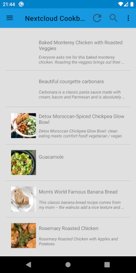
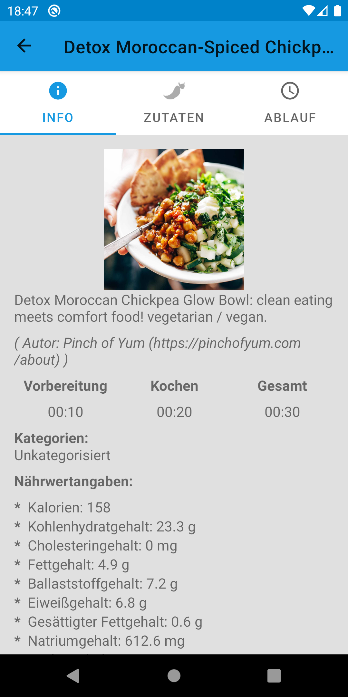
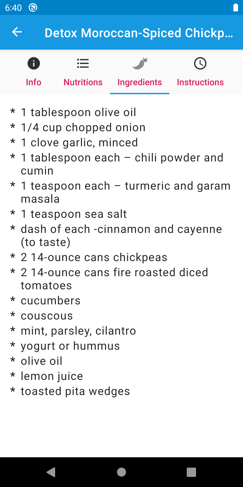

# Nextcloud-Cookbook

## About

This app is a viewer for recipes in Nextcloud App.
You need the Nextcloud Android client to sync the recipes.

Not updated anymore (cause of Google forcing App bundles):  

**First steps**

After installation you must go into the settings view and select the recipe directory with the recipes inside.
You find it on your storage under _Android/media/com.nextcloud.client/nextcloud/&lt;your account&gt;/&lt;folder&gt;_.

You also can choose the theme in the settings.

After that, the start view has a list of recipes and you select a recipe to view the details.

## Screenshots

## Funding

 |

## Roadmap

- Create new recipes
- Edit recipes
- Direct server synchronisation
- ...

## Translations

The project can be translated [here](https://weblate.bubu1.eu/projects/nextcloud-cookbook-android-app/).

Thanks to translators:

- [@mondstern](https://mastodon.technology/@mondstern)

## Contributors

Here I want to thank for contributions to the app.  
Thanks to

- [mrremo](https://codeberg.org/mrremo)
- [leafar](https://codeberg.org/leafar)

## Dependencies

This app needs Android &gt;= 6.0 (API &gt;= 23) and uses the libraries (see also app/build.gradle):

- androidx dependencies
- kotlinx coroutines
- kotlinx-serialization-json (json parser)
- [Dexter by Karumi](https://github.com/Karumi/Dexter) (permission handling)
- [SimpleStorage by anggrayudi](https://github.com/anggrayudi/SimpleStorage) (storage handling and choosing a directory)
- [CircularProgressView by GuilhE](https://github.com/GuilhE/CircularProgressView) (circular progress view)

## License

**Copyright 2020-2021 by MicMun**

This program is free software: you can redistribute it and/or modify it under the terms of the GNU
General Public License as published by the Free Software Foundation, either version 3 of the License, or
(at your option) any later version.
This program is distributed in the hope that it will be useful, but WITHOUT ANY WARRANTY;
without even the implied warranty of MERCHANTABILITY or FITNESS FOR A PARTICULAR PURPOSE.
See the GNU General Public License for more details.
You should have received a copy of the GNU General Public License along with this program. If not, see
[http://www.gnu.org/licenses/](http://www.gnu.org/licenses/).
